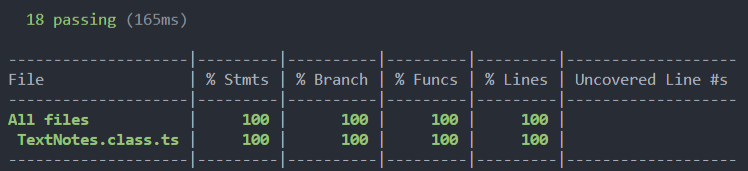
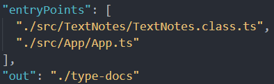

# Informe Práctica 9 - Aplicación de procesamiento de notas de texto

## 1. Introducción.
---
En esta práctica se implementa el **procesamiento de notas de texto mediante TypeScript**. Se podrá añadir, modificar, eliminar, listar e imprimir por consola notas de un *usuario* en concreto. Estas notas se encontrarán en la carpeta `database` en la raíz del proyecto, donde dentro encontraremos carpetas pertenecientes a cada *usuario* que ha guardado notas en **formato JSON**. Además, solo se podrá interactuar con la aplicación desde la línea de comandos.

## 2. Objetivos.
---
* Familiarizarse con la **API asíncrona** de Node.js para poder trabajar con sistemas de ficheros.
* Aprender a utilizar el **paquete yargs** para recibir parámetros por linea de comando y parsearlos.
* Aprender a utilizar el  **paquete chalk** el cual permite poner colores a los mensajes por consola.

## 3. Ejercicio.
---
El desarrollo del proyecto se encuentra en el directorio `./src` y los test unitarios en directorio`./tests`, ambos en la raíz del programa.

Se ha seguido una metodología **TDD** utilizando la herramienta **Mocha y Chai** donde se comprueba el correcto funcionamiento del código.

También se hace uso de la herramienta **Instambul** de Coveralls para obtener el porcentaje de cubrimiento de nuestro código.

Se cuenta con **3 GitHub Actions** para los *Tests*, el cubrimiento de código *(Coveralls)* y *Sonar Cloud*, estas actions se disparan cada vez que se haga un **push** al repositorio de la práctica.

## 4. Aplicación de procesamiento de notas de texto.
---
Los requisitos que debe cumplir la aplicación de procesamiento de notas de texto son los siguientes:

1. La aplicación de notas deberá permitir que múltiples usuarios interactúen con ella, pero no simultáneamente.
2. Una nota estará formada, como mínimo, por un título, un cuerpo y un color (rojo, verde, azul o amarillo).
3. Cada usuario tendrá su propia lista de notas, con la que podrá llevar a cabo las siguientes operaciones:

* Añadir una nota a la lista. Antes de añadir una nota a la lista se debe comprobar si ya existe una nota con el mismo título. En caso de que así fuera, deberá mostrarse un mensaje de error por la consola. En caso contrario, se añadirá la nueva nota a la lista y se mostrará un mensaje informativo por la consola.

* Modificar una nota de la lista. Antes de modificar una nota, previamente se debe comprobar que exista una nota con el título de la nota a modificar en la lista. Si existe, se procede a su modificación y se emite un mensaje informativo por la consola. En caso contrario, debe mostrarse un mensaje de error por la consola.

* Eliminar una nota de la lista. Antes de eliminar una nota, previamente se debe comprobar que exista una nota con el título de la nota a eliminar en la lista. Si existe, se procede a su eliminación y se emite un mensaje informativo por la consola. En caso contrario, debe mostrarse un mensaje de error por la consola.

* Listar los títulos de las notas de la lista. Los títulos de las notas deben mostrarse por la consola con el color correspondiente de cada una de ellas. Use el paquete `chalk` para ello.

* Leer una nota concreta de la lista. Antes de mostrar el título y el cuerpo de la nota que se quiere leer, se debe comprobar que en la lista existe una nota cuyo título sea el de la nota a leer. Si existe, se mostrará el título y cuerpo de la nota por la consola con el color correspondiente de la nota. Para ello, use el paquete `chalk`. En caso contrario, se mostrará un mensaje de error por la consola.

* Todos los mensajes informativos se mostrarán con color verde, mientras que los mensajes de error se mostrarán con color rojo. Use el paquete `chalk` para ello.

* Hacer persistente la lista de notas de cada usuario. Aquí es donde entra en juego el uso de la API síncrona de Node.js para trabajar con el sistema de ficheros:
  * Guardar cada nota de la lista a un fichero con formato JSON. Los ficheros JSON correspondientes a las notas de un usuario concreto deberán almacenarse en un directorio con el nombre de dicho usuario.
  * Cargar una nota desde los diferentes ficheros con formato JSON almacenados en el directorio del usuario correspondiente.

4. Un usuario solo puede interactuar con la aplicación de procesamiento de notas de texto a través de la línea de comandos. Los diferentes comandos, opciones de los mismos, así como manejadores asociados a cada uno de ellos deben gestionarse mediante el uso del paquete `yargs`.

**Ejercicio Resuelto:**

**Clase TextNotes:**
```ts

```

**Explicación de la clase TextNotes:**

He decidido realizar esta clase siguiendo el **patrón Singleton** ya que este es común en este tipo de ejercicios relacionado con ficheros ya que se tiene una única instancia.

* `import * as fs from 'fs';` es la importación de la API síncrona que proporciona Node.js.
* `import * as chalk from 'chalk';` es la importación del paquete `chalk`, el cual nos servirá para imprimir mensajes con colores por consola. Los **mensajes de éxito** se realizaran en color verde y los **mensajes de error** en color rojo.

Cabe recalcar que se ha creado un **enum** para los colores de las notas, así evitamos cualquier tipo de fallo en cuanto a cual color elegir.

Tenemos el atributo privado estático `notes` ya que, como dijimos antes, estamos siguiendo el patrón **Singleton**.

### Funciones.

* El **constructor de la clase** se encuentra vacío, ya que realizamos la instancia en `getNotes()`. Se a introducido un comentario dentro ya que Sonar Cloud me proponía esa solución frente a un *Code Smell*.

* La función **`getNotes()`** se trata de una función pública estática, donde inicializamos la instancia de la clase. Además de indicarle el nombre del directorio `database` donde se va a guardar todas las carpetas de los usuarios y sus notas de texto. Vemos que primero tenemos un condicional `if` para ver si la carpeta ya existe, en caso de que no exista se crea. También vemos si la instancia ya está creada, en caso de que no esté creada también la creamos ya que es lo que devuelve esta función.

* La función **`addNote()`** añade una nota a al directorio `database`. Es necesario pasarle por parámetro el usuario que la realiza, el título, el cuerpo y el color de la nota. Debemos crear la estructura que tendrá la nota, por ello se ha creado `fileStructure` que la define. En `joinTitle` decidí eliminar los espacios ya que los ficheros no pueden contener nombres con espacios. Acto seguido se hacen varias comprobaciones, primero miramos a ver si la carpeta del usuario existe (con ayuda de `existsSync`), si existe entonces comprobamos que la el título de la nota no coincida con otra, si coincide se devuelve un error. Si la carpeta del usuario no existe entonces se crea la carpeta y se añade la nota de ese usuario (utilizando `writeFileSync`). Cuando se añade la nota con extensión `json` es necesario pasarle la estructura que tendrá ese json además de la localización y el nombre.

* La función **`modifyNote()`** se encarga de modificar una nota que ya se encuentra dentro `database`, para ello también se le debe pasar un nombre de usuario, título, cuerpo y color de la nota. En cambio de `addNote()`, esta vez si no se encuentra el usuario o el título de la nota, se devuelve un mensaje de error. Si el usuario y la nota si existen entonces se sobrescribe la nota y devolvemos un mensaje de éxito.

* La función **`deleteNote()`** se encarga de eliminar una nota de `database`. Es necesario pasarle por parámetro el nombre de usuario y el título. Se comprueba si el usuario y el título existen, en caso de que no exista alguno de los dos se devuelve un mensaje de error, en caso contrario se elimina la nota con `rmSync` y se devuelve un mensaje de éxito.

* La función **`listNotes()`** se encarga de imprimir por consola los títulos de todas las notas que tenga un usuario. Por lo que necesita solamente el nombre de usuario por parámetro para ser buscado. En caso de que el usuario no sea encontrado se devuelve un mensaje de error. En caso de que el usuario si exista, entonces con ayuda de `readdirSync()` vamos iterando por cada nota, extrayendo su contenido e imprimiendolo por consola. Si se fijan se ha utilizado una función de `chalk` llamada `keyword` para indicar que el color que queremos se pasará como argumento, por lo que el resultado final será el nombre del título de la nota con su color correspondiente.

* La función **`printNote()`** se encarga de imprimir el contenido de una nota, el título y el cuerpo. Es necesario pasarle por parámetro el nombre de usuario y el título de la nota. Si el usuario o el título no se encuentran entonces se devuelve un mensaje de error. En caso de que se encuentren ambos, como en la función anterior, se imprimen por consola el título y el cuerpo en el color correspondiente de la nota.

**Fichero de la Aplicación:**

```ts

```

**Explicación del fichero de la Aplicación:**

Aquí entra en juego el **paquete yargs**, donde se utiliza para parsear los argumentos pasados desde la linea de comandos. Para ello primero se debe importar el paquete mediante `import * as yargs from 'yargs';`.

Creamos una instancia de `TextNotes` utilizando el método que hemos definido antes `getNotes()`.

Para comenzar debemos utilizar `yargs.command()` donde se especificará el comando. Dentro de este tenemos varios campos:
* `command` hace referencia al comando que se va a escribir por la terminal, para las diferentes acciones que debemos hacer deberemos tener:
  * `add` para añadir una nota.
  * `modify` para modificar una nota.
  * `delete` para eliminar una nota.
  * `list` para listar todas las notas de un usuario.
  * `print` para imprimir por consola una nota.


* `describe` indica lo que realiza el comando.
* `builder` indica los argumentos que es necesario que se pase por la línea de comandos. Cada argumento empezará con su nombre seguido de dos puntos, a continuación encontramos:
  * `describe` describe el argumento.
  * `demandOption` permite mostrar el comando en el menú de opciones de comando.
  * `type` el tipo que tendrá la variable cuando se introduzca.

Es importante decir que es necesario que haya tantos argumentos a introducir por línea de comandos como parámetros para los métodos de la clase `TextNotes`.

Es necesario utilizar el `handler()` ya que es el encargado de parsear los argumentos que hemos introducido por consola. Aquí es donde se llamarán a los métodos correspondientes pasándoles los parámetros correspondientes.

Para el caso de los argumentos `add` y `modify` se debe buscar en el **enum** de colores si el color especificado existe, si no existe, **el color por defecto de las notas será el color azul**.

Se debe añadir al final del archivo **`yargs.parse();`** para que se procesen todos los argumentos.

**Metodología TDD:**

```ts
import 'mocha';
import * as fs from 'fs';
import {expect} from 'chai';
import {TextNotes, colors} from '../src/TextNotes/TextNotes.class';

describe('Practica 9 - Tests', () => {
  const notes: TextNotes = TextNotes.getNotes();
  describe('TextNotes class tests', () => {
    it('The object \'notes\' is not null', () => {
      expect(notes).not.to.be.equal(null);
    });
    it('getNotes() function returns \'notes\'', () => {
      expect(TextNotes.getNotes()).to.be.eql(notes);
    });

    describe('addNote() method tests', ()=> {
      it('notes.addNote() returns New note added! with title: First attempt.', () => {
        expect(notes.addNote('Jeff', 'First attempt', 'Hello, I am Jeff', colors.green)).to.be.equal('New note added! with title: First attempt.');
      });
      it('notes.addNote() returns New note added! with title: Second attempt.', () => {
        expect(notes.addNote('Jeff', 'Second attempt', 'Hello, I am Jeff', colors.blue)).to.be.equal('New note added! with title: Second attempt.');
      });
      it('notes.addNote() returns New note added! with title: Third attempt.', () => {
        expect(notes.addNote('Jack', 'Third attempt', 'Hello, I am Jack', colors.red)).to.be.equal('New note added! with title: Third attempt.');
      });
      it('notes.addNote() returns New note added! with title: Fourth attempt.', () => {
        expect(notes.addNote('Jack', 'Fourth attempt', 'Hello, I am Jack', colors.yellow)).to.be.equal('New note added! with title: Fourth attempt.');
      });
      it('notes.addNote() returns Error: Note title taken!', () => {
        expect(notes.addNote('Jeff', 'First attempt', 'Hello, I am Jeff', colors.green)).to.be.equal('Error: Note title taken!');
      });
    });

    describe('modifyNote() method tests', () => {
      it('notes.modifyNote() returns Successfully modified note! with title: First attempt', () => {
        expect(notes.modifyNote('Jeff', 'First attempt', 'Hi, Jeff is my name', colors.red)).to.be.equal('Successfully modified note! with title: First attempt');
      });
      it('notes.modifyNote() returns Error: User not found!', () => {
        expect(notes.modifyNote('Erick', 'First attempt', 'Hi Erick', colors.blue)).to.be.equal('Error: User not found!');
      });
      it('notes.modifyNote() returns Error: Title does not exist!', () => {
        expect(notes.modifyNote('Jeff', 'Fifth attempt', 'Hi, Jeff is my name', colors.red)).to.be.equal('Error: Title does not exist!');
      });
    });

    describe('deleteNote() method tests', () => {
      it('notes.deleteNote() should return:  Note deleted! with title: First attempt', () => {
        expect(notes.deleteNote('Jeff', 'First attempt')).to.be.equal('Note deleted! with title: First attempt');
      });
      it('notes.deleteNote() should return:  Error: Title does not exist!', () => {
        expect(notes.deleteNote('Jeff', 'Fourth attempt')).to.be.equal('Error: Title does not exist!');
      });
      it('notes.deleteNote() should return:  Error: User not found!', () => {
        expect(notes.deleteNote('Jake', 'First attempt')).to.be.equal('Error: User not found!');
      });
    });

    describe('listNotes() method tests', () => {
      it('notes.listNotes() returns # Fourth attempt # Third attempt', () => {
        expect(notes.listNotes('Jack')).to.be.equal('# Fourth attempt\n# Third attempt\n');
      });
      it('notes.listNotes() returns Error: User not found!', () => {
        expect(notes.listNotes('John')).to.be.equal('Error: User not found!');
      });
    });

    describe('printNote() method tests', () => {
      it('notes.printNote() should return # Title: Second attempt # Body: Hello, I am Jeff', () => {
        expect(notes.printNote('Jeff', 'Second attempt')).to.be.equal('# Title: Second attempt \n# Body: Hello, I am Jeff');
      });
      it('notes.printNote() should return Error: Title does not exist!', () => {
        expect(notes.printNote('Jeff', 'Third attempt')).to.be.equal('Error: Title does not exist!');
      });
      it('notes.printNote() should return Error: User not found!', () => {
        expect(notes.printNote('Mike', 'First attempt')).to.be.equal('Error: User not found!');
      });
    });
  });
});
// Delete directory.
fs.rmdirSync('./database', {recursive: true});
```

**Resultado de las pruebas:**

```bash
  Practica 9 - Tests
    TextNotes class tests
      ✔ The object 'notes' is not null
      ✔ getNotes() function returns 'notes'
      addNote() method tests
        ✔ notes.addNote() returns New note added! with title: First attempt. 
        ✔ notes.addNote() returns New note added! with title: Second attempt.
        ✔ notes.addNote() returns New note added! with title: Third attempt. 
        ✔ notes.addNote() returns New note added! with title: Fourth attempt.
        ✔ notes.addNote() returns Error: Note title taken!
      modifyNote() method tests
        ✔ notes.modifyNote() returns Successfully modified note! with title: First attempt
        ✔ notes.modifyNote() returns Error: User not found!
        ✔ notes.modifyNote() returns Error: Title does not exist!
      deleteNote() method tests
        ✔ notes.deleteNote() should return:  Note deleted! with title: First attempt      
        ✔ notes.deleteNote() should return:  Error: Title does not exist!
        ✔ notes.deleteNote() should return:  Error: User not found!
      listNotes() method tests
        ✔ notes.listNotes() returns # Fourth attempt # Third attempt
        ✔ notes.listNotes() returns Error: User not found!
      printNote() method tests
        ✔ notes.printNote() should return # Title: Second attempt # Body: Hello, I am Jeff
        ✔ notes.printNote() should return Error: Title does not exist!
        ✔ notes.printNote() should return Error: User not found!

  18 passing (75ms)
```

# 5. Cubrimiento de código (Coveralls - Instambul).
---
En esta práctica se han añadido un informe de cubrimiento de código. Así podemos observar el porcentaje de nuestro código que está cubierto por las pruebas realizadas con **Mocha y Chai**.

Ejecutamos el comando **npm run coverage** para obtener la tabla con los resultados por consola.



**Aunque esta vez ya este proceso se encuentra automatizado mediante una `GitHub Action` donde cada vez que se realiza un `push` al repositorio se envía el análisis a la página de `Coveralls`.**


# 6. Documentación.
---
Esta práctica también cuenta con la documentación del código generada por TypeDoc, para generarla es necesario añadir todos los ficheros a la configuración de `typedoc.json`.



A continuación ejecutamos el comando `npm run doc` y se nos generaran todos los archivos en la carpeta de salida que hemos escrito.

En esta carpeta abrimos el `index.html` con la extensión de VSCode llamada `Live Server` para poder ver el contenido de la página.


# 7. Conclusión.
---